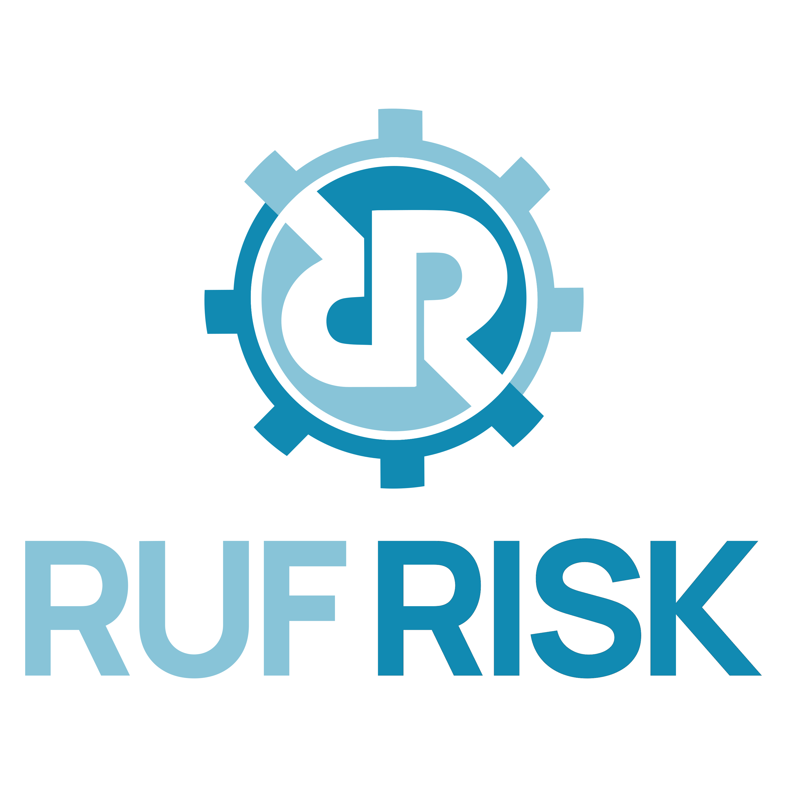

    <h1 style="border:none; ">&nbsp;CyberCraft</h1>

CyberCraft is a desktop graphical user interface (GUI) application for viewing, validating, and converting OSCAL content. It runs as a stand-alone, and while it can interact across a network, no network connectivity is required.

  

# CyberCraft Development

CyberCraft is based on Python 3.12, PySide6, and the SaxonC HE Python Library. It is designed to be compliled to a single executable file for Windows and Mac using PyInstaller.

The desktop application simulates a back-end web server and front-end browser entirely _within_ the application's execution space. Ports are not open. A network is not required. 

The code base for CyberCraft's architecture started with an [example desktop web browser application published by Qt](https://doc.qt.io/qtforpython-6.2/examples/example_webenginewidgets__tabbedbrowser.html).

For more information, check out the [Technical Details](./docs/TECHNICAL_DETAILS.md).

# Coming Soon

- Load any OSCAL content in any OSCAL syntax version and format.
- Validate the syntax
- Convert to any OSCAL format.
- Handle OSCAL import challenges
- View content metadata

**CYBERCRAFT IS STILL IN THE EARLY STAGES OF DEVELOPMENT**

  
---

CyberCraft is created by

 
_Cybersecurity&nbsp;Automation_&nbsp;&nbsp;_OSCAL&nbsp;Enablement_ 
_Consulting_&nbsp;&nbsp;_Proposal&nbsp;Support_&nbsp;&nbsp;_Training_ 
<a href="https://RufRisk.com" style="font-style: normal;" target="_blank">https://RufRisk.com</a>

---

