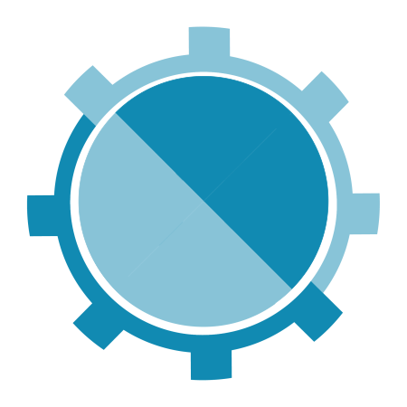

    <h1 style="border:none; ">&nbsp;CyberCraft</h1>

CyberCraft is a desktop graphical user interface (GUI) application for viewing, validating, and converting OSCAL content. It runs as a stand-alone, and while it can interact across a network, no network connectivity is required.

 

---
## Table of Contents

Please see each of the following sections for more information:
- [Technical Overview](#technical-overview)
- [Development Status](#development-status)
- [Getting Started](#getting-started)
---
# Technical Overview

CyberCraft is based on Python 3.12, PySide6, and the SaxonC HE Python Library. It is designed to be compliled to a single executable file for Windows and Mac using PyInstaller.

The desktop application simulates a back-end web server and front-end browser entirely _within_ the application's execution space. Ports are not open. A network is not required. 

The code base for CyberCraft's architecture started with an [example desktop web browser application published by Qt](https://doc.qt.io/qtforpython-6.2/examples/example_webenginewidgets__tabbedbrowser.html).

For more information, check out the [Technical Details](./docs/TECHNICAL_DETAILS.md).

# Development Status

**CYBERCRAFT IS IN THE EARLY STAGES OF DEVELOPMENT**

## Complete/Functioning

- Application Framework Established
  - GUI and CLI capabilities
  - Robust logging
  - OS-appropriate application folders used
  - _Portable Mode_ to keep all application folders in the startup location
- Acquisition and management of NIST-published OSCAL support files:
  - NIST-published OSCAL schema validation files
  - NIST-publised OSCAL format convertion files
  - **all OSCAL versions and formats supported**
  - Ability to check for and acquire support files for new OSCAL versions when available
  - Use GUI for interactive management
  - Use CLI for unattended management

## In-Progress (Spring 2025)

- Project approach for managing a collection of related OSCAL content (i.e. AR -> AP -> SSP -> Controls)
  - Manage project metadata
  - Load OSCAL content into project
  - Auto-load related OSCAL artifacts 
  - Handle missing or unreachable content
  - Auto-validate OSCAL Content using NIST schema-validation files
  - Export OSCAL content in any OSCAL format using NIST format convertion files.
  - View OSCAL content metadata

## Planned
- Remote Sources
  - Access and load content from the OSCAL Content Registry ([https://registry.oscal.io](https://registry.oscal.io))
- View Specific OSCAL Content:
  - Control Catalogs and Baselines
  - Component Definitions
  - SSP
  - POA&M
  - AP and AR 
- Collaborative Viewing
  - Network shares of CyberCraft projects
  - Cloud drive shares of CyberCraft projects
  - Use of enterprise relational databases for shared project content 
- Load/process NIST-published OSCAL Metaschema for more robust OSCAL content validation
- Collaborative Reviewing
  - Attach review comments to OSCAL content
  - Threaded comment conversations
  - Comment resolution tracking
- OSCAL Content Authoring:
  - Baselines/Profiles
  - Component Definitions

---
# Getting Started

You have three options for using CyberCraft:
- **Pre-Compiled**: Download a pre-compliled executable for Windows or macOS. (_Planned: Summer 2025_)
- **Complile Yourself**: Complile the Python code to an executable for your Windows or macOS platform.
- **Native Python**: Run the native Python code on your Windows or macOS platform. 
  - _May work on Linux. Untested._

See [Installation](./docs/INSTALLATION.md) for instructions related to each option.

  
---

CyberCraft is created by

 
_Cybersecurity&nbsp;Automation_&nbsp;&nbsp;_OSCAL&nbsp;Enablement_ 
_Consulting_&nbsp;&nbsp;_Proposal&nbsp;Support_&nbsp;&nbsp;_Training_ 
<a href="https://RufRisk.com" style="font-style: normal;" target="_blank">https://RufRisk.com</a>

---

